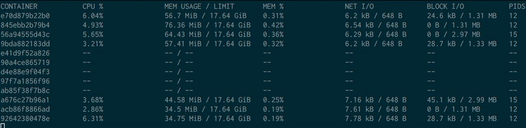
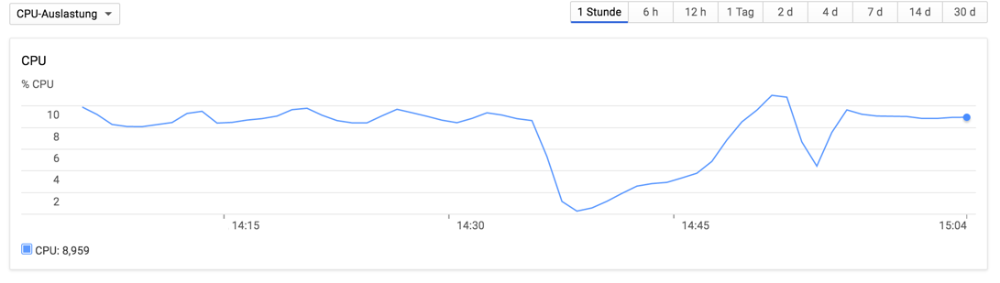
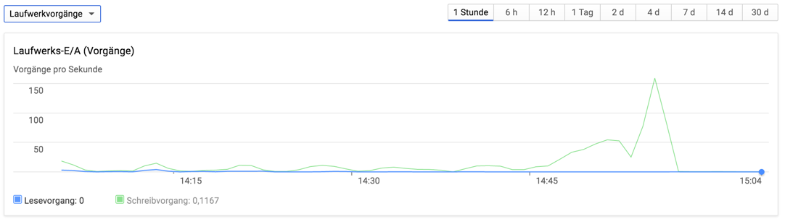
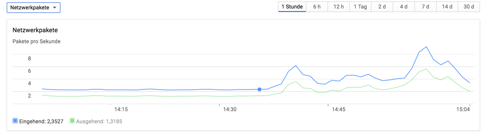

# Docker stresstest using `docker exec`

(this is not a real benchmark)

## IntroductionLet's stress docker

Run it with `bash start.sh 10` for 10 parallized `docker exec` or
`bash start.sh 10 |  pv -l -i10 -r -W >/dev/null` to get lines per second
calculated every 10 seconds. After echt execution the script waits for 0.5 secs.

The fist calculation is maybe not correct due to container creation or warmup so please wait
for the second one :)

For using different API tests use:

`docker version` test:
`TEST=version bash start.sh 10 |  pv -l -i10 -r -W >/dev/null`

`docker info` test:
`TEST=info bash start.sh 10 |  pv -l -i10 -r -W >/dev/null`

PS: It's just a quick&dirty benchmark to check why serverspec is so slow.

### Results (lines/sec)

`docker exec` will have lower values because of the execution overhead and is totally fine.

| Concurrency | `docker exec` | `docker version` | `docker info` |
|:-----------:|--------------:|-----------------:|--------------:|
|      1      |           1.1 |              1.3 |           1.3 |
|      2      |           2.2 |              2.6 |           2.5 |
|      3      |             3 |              3.9 |           3.7 |
|      4      |             4 |                5 |           4.9 |
|      5      |             5 |                6 |             6 |
|      6      |         5 - 6 |              7.3 |           7.3 |
|      7      |        5.6 -7 |              8.5 |           8.5 |
|      8      |           6.5 |              9.7 |           9.6 |
|      9      |         7 - 8 |               11 |          10.8 |
|     10      |         7 - 8 |               12 |          11.7 |
|     20      |       10 - 14 |             ~ 24 |            24 |
|     30      |            19 |             ~ 35 |            35 |
|     40      |       14 - 20 |             ~ 50 |            50 |
|     50      |       16 - 19 |             ~ 60 |            60 |
|     100     |       13 - 22 |            ~ 120 |            40 |

So there is a limit of 18 to 20 `docker exec` calls to docker api?
When running with 100 concurrent `docker exec` processes the load is betwen 1.6 and 2.2.
CPU usage around 5 % user, 3 % sys, 92 % idle and no wait. 12 GB free memory without swapping.

After 20 concurrent `docker exec` processes the `docker stats` output is not realiable (see animated gif below).

## Why?

I'm using serverspec for testing Docker images after building which is executing
the tests with container exec api using docker-api in Ruby.
On a 16 core VM tests should be faster if tests are executed in parallel
for each container independently but it's getting slower and slower.

Some tests are running for 6 Minutes when running 6 parallized container tests,
with 10 parallized tests the these tests are running for about 10-15 Minutes.

With more then 6 running serverspec processes the result of `docker stats` is also not reliable:




Server cpu usage is around ~10-20% (load 1-4) with not more then 5 GB memory used (~20 GB total),
most of the time 10 - 50 IOPS for read and write (in memory caching?) and
disk transfer bandwidth not more than 1 M/sec.
These serverspec tests are running in parallel right? Doesn't seem so...

### Server specs

Google Cloud Compute Machine (europe-west1-d):
* Ubuntu 16.04
* Docker CE
* 16 vCores (Intel Haswell)
* 14 GB RAM (never exceeded the memory limit)
* /var/lib/docker on local 375 GB NVM scratch SSD (read: 100.000 IOPS, write: 70.000 IOPS)
* /var/lib/docker (ext4) on overlay2 (same problems with AUFS)
* Runs only SSH and Docker
* Only for testing, no other tasks

Same problems also on a VM in Microsoft Azure (8 Cores) and on docker machine (dinghy) on a 4 core MacBook Pro.

#### docker version

```
Client:
 Version:      17.03.1-ce
 API version:  1.27
 Go version:   go1.7.5
 Git commit:   c6d412e
 Built:        Mon Mar 27 17:14:09 2017
 OS/Arch:      linux/amd64

Server:
 Version:      17.03.1-ce
 API version:  1.27 (minimum version 1.12)
 Go version:   go1.7.5
 Git commit:   c6d412e
 Built:        Mon Mar 27 17:14:09 2017
 OS/Arch:      linux/amd64
 Experimental: false
```

#### docker info

```
Containers: 0
 Running: 0
 Paused: 0
 Stopped: 0
Images: 1
Server Version: 17.03.1-ce
Storage Driver: overlay2
 Backing Filesystem: extfs
 Supports d_type: true
 Native Overlay Diff: true
Logging Driver: json-file
Cgroup Driver: cgroupfs
Plugins:
 Volume: local
 Network: bridge host macvlan null overlay
Swarm: inactive
Runtimes: runc
Default Runtime: runc
Init Binary: docker-init
containerd version: 4ab9917febca54791c5f071a9d1f404867857fcc
runc version: 54296cf40ad8143b62dbcaa1d90e520a2136ddfe
init version: 949e6fa
Security Options:
 apparmor
 seccomp
  Profile: default
Kernel Version: 4.8.0-46-generic
Operating System: Ubuntu 16.04.2 LTS
OSType: linux
Architecture: x86_64
CPUs: 16
Total Memory: 14.09 GiB
Name: webdevops-docker
ID: HLLW:XT5U:F3DJ:I3UF:2EKD:YZVS:MLCK:67HD:QDNR:4FFN:EYWK:L7YE
Docker Root Dir: /mnt
Debug Mode (client): false
Debug Mode (server): false
Registry: https://index.docker.io/v1/
WARNING: No swap limit support
Experimental: false
Insecure Registries:
 127.0.0.0/8
Live Restore Enabled: false
```

### Other stuff

#### using strace (client)

Exec: `strace -f -e verbose=all -v -p 24371` on the run-container.sh (PID 24371).

Is the docker client getting the `EAGAIN (Resource temporarily unavailable)`? But why?  Because of a limit? A lock inside the API?

```
[pid 23777] select(0, NULL, NULL, NULL, {0, 20} <unfinished ...>
[pid 23780] <... futex resumed> )       = 1
[pid 23783] <... futex resumed> )       = 0
[pid 23783] epoll_wait(4,  <unfinished ...>
[pid 23780] shutdown(5, SHUT_WR <unfinished ...>
[pid 23783] <... epoll_wait resumed> [{EPOLLOUT, {u32=3224444584, u64=140706353061544}}], 128, 0) = 1
[pid 23780] <... shutdown resumed> )    = 0
[pid 23777] <... select resumed> )      = 0 (Timeout)
[pid 23783] epoll_wait(4,  <unfinished ...>
[pid 23780] read(5,  <unfinished ...>
[pid 23783] <... epoll_wait resumed> [{EPOLLOUT, {u32=3224444584, u64=140706353061544}}], 128, -1) = 1
[pid 23780] <... read resumed> 0xc42044e000, 32777) = -1 EAGAIN (Resource temporarily unavailable)
[pid 23783] epoll_wait(4,  <unfinished ...>
[pid 23780] futex(0xc420072110, FUTEX_WAIT, 0, NULL <unfinished ...>
[pid 23777] clock_gettime(CLOCK_MONOTONIC, {23766, 734920914}) = 0
[pid 23777] clock_gettime(CLOCK_REALTIME, {1492002016, 12975401}) = 0
[pid 23777] select(0, NULL, NULL, NULL, {0, 20}) = 0 (Timeout)
[pid 23777] clock_gettime(CLOCK_MONOTONIC, {23766, 735063479}) = 0
[pid 23777] futex(0x115e838, FUTEX_WAIT, 0, {60, 0} <unfinished ...>
[pid 23783] <... epoll_wait resumed> [{EPOLLIN|EPOLLOUT, {u32=3224444584, u64=140706353061544}}], 128, -1) = 1
[pid 23783] clock_gettime(CLOCK_MONOTONIC, {23769, 581316547}) = 0
[pid 23783] futex(0x115e838, FUTEX_WAKE, 1) = 1
[pid 23777] <... futex resumed> )       = 0
[pid 23783] read(5,  <unfinished ...>
[pid 23777] clock_gettime(CLOCK_MONOTONIC,  <unfinished ...>
[pid 23783] <... read resumed> "\1\0\0\0\0\0\0\35Wed Apr 12 13:00:18 UTC "..., 32777) = 37
[pid 23777] <... clock_gettime resumed> {23769, 581425249}) = 0
[pid 23783] write(1, "Wed Apr 12 13:00:18 UTC 2017\n", 29 <unfinished ...>
[pid 23777] clock_gettime(CLOCK_REALTIME,  <unfinished ...>
[pid 23783] <... write resumed> )       = 29
[pid 23777] <... clock_gettime resumed> {1492002018, 859508207}) = 0
[pid 24371] <... read resumed> "Wed Apr 12 13:00:18 UTC 2017\n", 128) = 29
```

#### Server usage stats

###### CPU usage:


###### IOPS usage:


###### Network usage:


(sure, there is no network happening in this test)